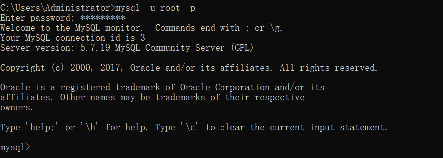
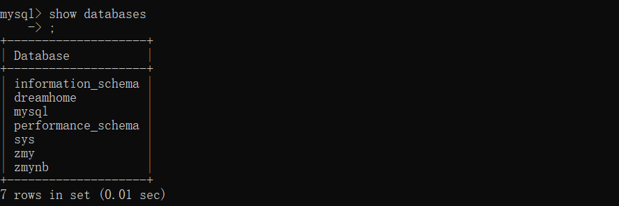
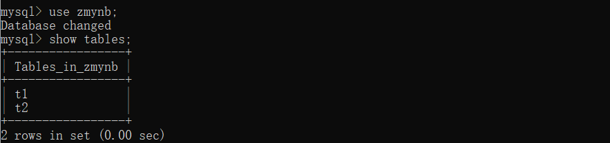
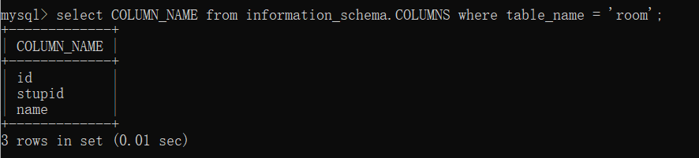
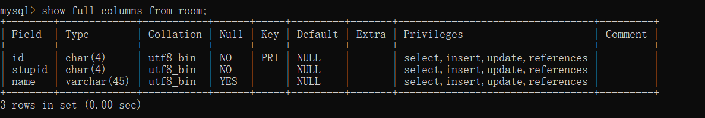
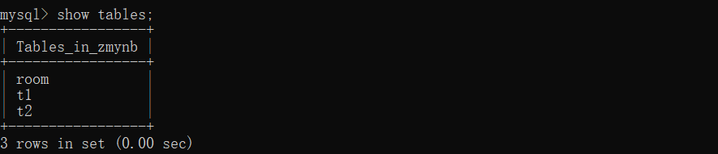
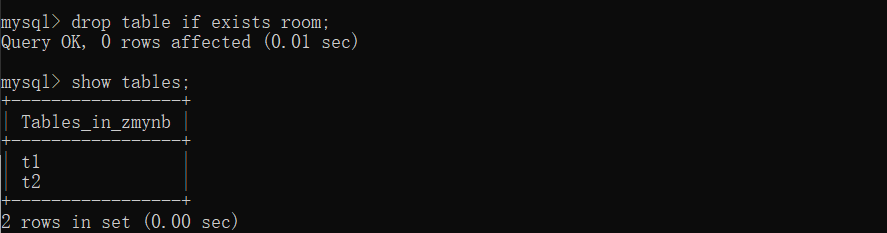
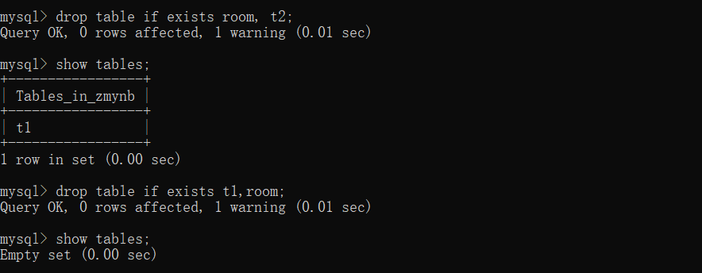

# sql

## 写在前面

1. 登录mysql



2. 查看数据库(show database)



3. 选取某一数据库(use 'databasename')

    + 选取 zmynb 这个数据库

4. 展示这一数据库的表(show tables)

    

    + zmynb 这个数据库中，有t1,t2两个表

## Introduction to sql

1. Data definition language(DDL)
    1. create table
    2. drop table
2. Data manipulation language(DML)
    1. insert 
    2. delete
    3. update
    4. select   

## DDL

### objects

+ table

### commands

+ create
+ alter
+ drop

### example

#### **<u>create table</u>**

```sql
CREATE TABLE table_name(column1 datatype, column2 datatype,...,PRIMARY KEY(one or more column));
CREATE TABLE room (
id char(4) NOT NULL,
stupid char(4) NOT NULL,
name varchar(45) default null,
PRIMARY KEY (id)
);
```


+ 展示room的attribute(col列)

```sql
select COLUMN_NAME from information_schema.COLUMNS where table_name = 'your-table-name';
select COLUMN_NAME from information_schema.COLUMNS where table_name = 'room';
```



+ 或者采用

    ```sql
    show full columns from room;
    ```

    

#### **<u>drop table</u>**

```sql
DROP TABLE [IF EXISTS] 表名1 [ ,表名2, 表名3 ...]
```

+ 表名1，表名2，...表示要被删除的数据表的名称
+ IF EXISTS 用于在删除数据表之前判断该表是否存在，如果不加IF EXISTS,当数据表不存在时，MySQL将提示错误，中断 SQL 语句的执行；加上 IF EXISTS 后，当数据表不存在时 SQL 语句可以顺利执行，但是会发出警告（warning）。

现在zmynb数据库中有三个表



删除room表，并展示剩余表



在现有基础上，删除t2,room（已被删除的表room在后）看看会发生什么？

删除过后，再删除room,t1(已被删除的表room在前)看看会发生什么？



1. 删除 t2, room 请求执行，产生warning，t2被删除，只剩t1
2. 删除 room, t1请求执行，产生warning，t1被删除，该数据库为空
3. 以上表明，语句会全部正常进行尽管有warning

我们再重新创建room表

#### **alter**

(to be added)