# DML

Data manipulation language

+ Insert
+ Delete
+ Update
+ Select

## Insert

```sql
INSERT INTO TableName [(columnList)]
VALUES(dataValueList)
```

+ columnList is optional; if omitted, sql assumes a list of all columns in their original CREATE TABLE order
+ Any columns omitted must have been declared as NULL when table was created, unless DEFAULT was specified when creating column

首先选中zmynb数据库，展示列

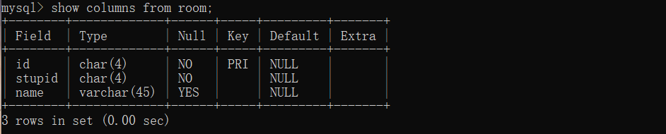

1. Insert Values

    1. 利用具体值

    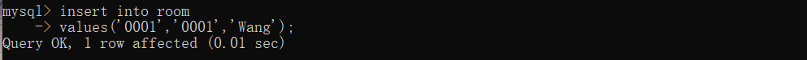

    2. 利用默认值

    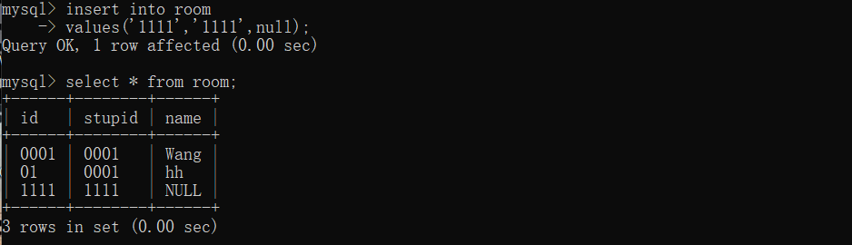

## Basic SELECT Statement

```sql
SELECT A1,A2,...,An
FROM R1,R2,...,Rn
WHERE condition
```

- ALL Columns, All Rows

    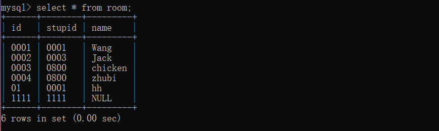

- Specific Columns, All Rows

    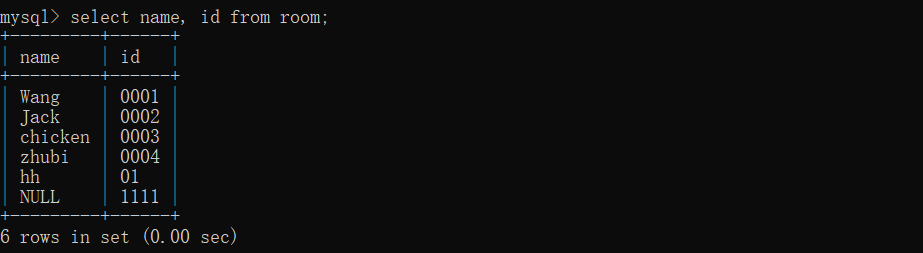

- Use of Distinct

    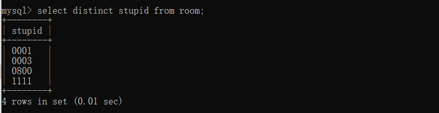

- Calculated Fields (这个例子比较特殊，数据类型是char(4))

    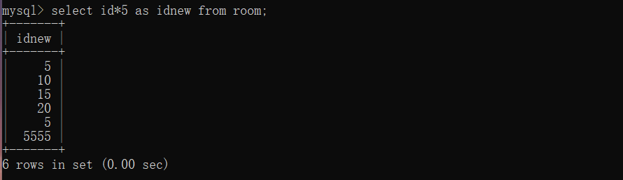

- Comparison Search Condition

    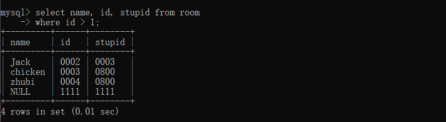

- Compound Comparison Search Condition

    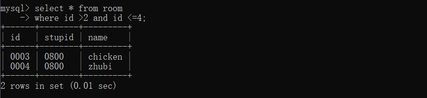

- Range Search Condition

    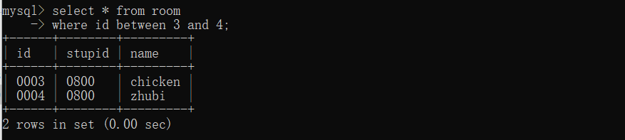

- Pattern Matching

    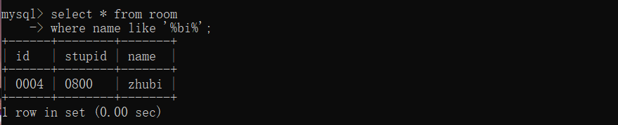

- NULL Search Condition

    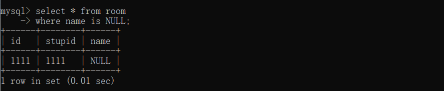

- Single Column Ordering

    - 默认从上到下升序
    - 如果要从上到下降序，需要用DESC

    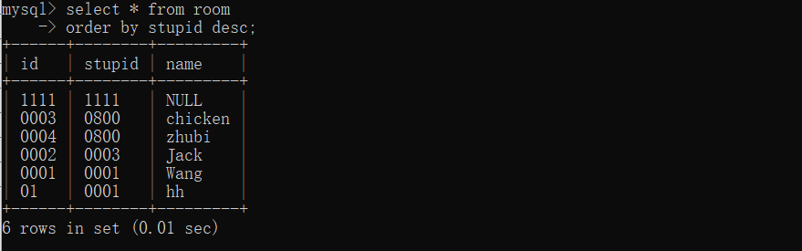

- Multiple Column Ordering

    - 先利用stupid降序，在此基础上，id升序

    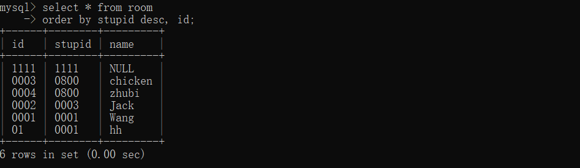